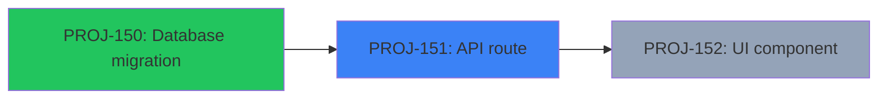

# Status Command

Display comprehensive project progress for `$ARGUMENTS`.

## Workflow

### Step 1: Load Project Manifest

Read `.resources/context/$ARGUMENTS/manifest.json` to get:
- Project name, slug, Linear URL
- Wave definitions (which tasks in each wave)
- Total task count

If the manifest does not exist, report "Project not found: $ARGUMENTS" and stop.

### Step 2: Load Task Statuses

For each task listed in the manifest, read `.resources/context/$ARGUMENTS/tasks/{task-id}.json` and extract:
- `id` -- task identifier (e.g., PROJ-150)
- `title` -- task title
- `status` -- current status (todo, in-progress, qa, complete, blocked)
- `depends_on` -- array of dependency task IDs
- `wave` -- wave number
- `verification` -- verification method summary

Collect all task data into a single list.

### Step 3: Compute Wave Progress

For each wave, calculate:
- Total tasks in wave
- Completed tasks (status = complete)
- Wave status: "Done" if all complete, "In Progress" if any in-progress/qa, "Blocked" if any blocked, "Pending" otherwise
- Whether tasks in this wave can run in parallel

### Step 4: Display Project Overview

```
## Project: {name}
- **Slug**: {slug}
- **Linear**: {url}
- **Total Tasks**: {count}
- **Progress**: {completed}/{total} ({percentage}%)
```

### Step 5: Display Wave Progress Table

```markdown
| Wave | Tasks | Completed | Status | Parallel |
|------|-------|-----------|--------|----------|
| 1    | 3     | 3/3       | Done   | Yes      |
| 2    | 2     | 1/2       | In Progress | Yes |
| 3    | 1     | 0/1       | Pending | No      |
```

### Step 6: Display Task Detail Table

```markdown
| Task | Title | Status | Depends On | Wave | Verification |
|------|-------|--------|------------|------|--------------|
| PROJ-150 | Database migration | complete | -- | 1 | Migration applied, schema verified |
| PROJ-151 | API route | in-progress | PROJ-150 | 2 | E2E test passes |
| PROJ-152 | UI component | todo | PROJ-151 | 3 | Browser verification |
```

Use status indicators:
- `complete` -- task is done
- `in-progress` -- actively being worked
- `qa` -- quality gates running
- `todo` -- not started
- `blocked` -- dependency not met

### Step 7: Display Dependency Graph

Generate a Mermaid flowchart from the dependency data:



Color coding:
- Green (`#22c55e`) -- complete
- Blue (`#3b82f6`) -- in-progress / qa
- Red (`#ef4444`) -- blocked
- Gray (`#94a3b8`) -- todo / pending

### Step 8: Display Knowledge Base Stats

Use Glob to count solution files:

```
Glob pattern: docs/solutions/**/*.md
```

Use Grep to count critical patterns:

```
Grep pattern: "^## " in docs/solutions/patterns/critical-patterns.md
```

Display:

```
## Knowledge Base
- **Total Solutions**: {count} documents
- **Critical Patterns**: {count} entries
- **Top Categories**:
  - database-issues: {n} solutions
  - api-issues: {n} solutions
  - build-errors: {n} solutions
```

Count files per subdirectory under `docs/solutions/` to determine top categories. Exclude the `patterns/` subdirectory from category counts.

## Error Handling

- If `$ARGUMENTS` is empty, list all projects found under `.resources/context/` and prompt user to specify one.
- If manifest is missing or malformed, report the error clearly.
- If individual task JSON files are missing, show the task as "unknown" status and note the missing file.
- If `docs/solutions/` does not exist, show "Knowledge base not initialized" for that section.
