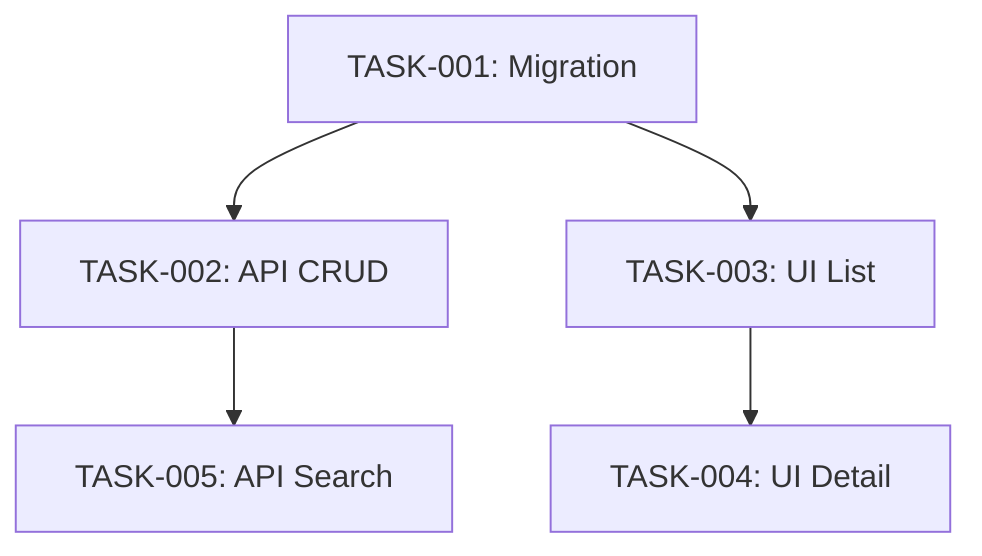

# Dependency Modeling Guide

This guide defines how to model task dependencies as a directed acyclic graph (DAG) and compute execution waves.

## Core Concepts

### Dependency Types

- **blocks**: This task must complete before the dependent task can start
- **blockedBy**: This task cannot start until the listed tasks complete

These are inverses of each other. If Task A blocks Task B, then Task B is blockedBy Task A.

### Waves

Tasks in the same wave can run in parallel. A task's wave number is:
```
max(wave of all blockedBy tasks) + 1
```

Wave 1 tasks have no dependencies (blockedBy is empty).

## Modeling Process

### 1. List All Tasks

Write out every task with its ID, title, and layer:
```
TASK-001: Migration — orders table
TASK-002: API — order CRUD endpoints
TASK-003: UI — order list view
TASK-004: UI — order detail view
TASK-005: API — order search endpoint
```

### 2. Identify Dependencies

For each task, ask:
- What does this task NEED to exist before it can start?
- What would BREAK if this ran before another task?

Common dependency patterns:
- Migration → API (API code imports types from migrated schema)
- API → UI (UI calls the API)
- Type update → All consumers of that type
- Foundation component → Pages that use it

### 3. Assign Waves

After identifying all dependencies, compute wave numbers:

```
Wave 1 (no dependencies):
  TASK-001: Migration

Wave 2 (depends on Wave 1):
  TASK-002: API CRUD (blockedBy: TASK-001)
  TASK-003: UI list view (blockedBy: TASK-001)

Wave 3 (depends on Wave 2):
  TASK-004: UI detail view (blockedBy: TASK-003)
  TASK-005: API search (blockedBy: TASK-002)
```

### 4. Validate — No Circular Dependencies

Check that no task is in its own transitive dependency chain. If you find a cycle, the task decomposition is wrong — split one of the tasks to break the cycle.

### 5. Draw the Mermaid Diagram



## Output: manifest.json

The manifest captures all wave and dependency information:

```json
{
  "projectSlug": "project-slug",
  "waves": [
    {
      "wave": 1,
      "tasks": ["TASK-001"]
    },
    {
      "wave": 2,
      "tasks": ["TASK-002", "TASK-003"]
    },
    {
      "wave": 3,
      "tasks": ["TASK-004", "TASK-005"]
    }
  ],
  "dependencies": {
    "TASK-002": { "blockedBy": ["TASK-001"], "blocks": ["TASK-005"] },
    "TASK-003": { "blockedBy": ["TASK-001"], "blocks": ["TASK-004"] },
    "TASK-004": { "blockedBy": ["TASK-003"], "blocks": [] },
    "TASK-005": { "blockedBy": ["TASK-002"], "blocks": [] }
  }
}
```

Write this file to `.resources/context/{slug}/manifest.json`.

## Anti-Patterns

- Do NOT make everything depend on everything — false dependencies eliminate parallelism
- Do NOT create waves with only 1 task when tasks are actually independent
- Do NOT skip the Mermaid diagram — it is the visual validation of your DAG logic
