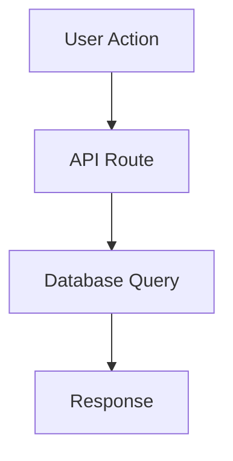

# PRD Creation Guide

This guide defines how to write a Product Requirements Document (PRD) for a software feature. The PRD is the source of truth for what gets built. It lives in the Linear project body (`project.content`).

## Required Sections

A complete PRD must contain all of the following sections:

### 1. Overview

2-4 sentences. What is this feature, who uses it, and what problem does it solve? No technical details here — this is the elevator pitch.

### 2. Business Motivation

Why is this being built now? Include:
- The business or user pain this addresses
- Success metrics if defined (e.g., "reduce time to complete an order from 5 min to 2 min")
- Any deadlines or dependencies from other initiatives

### 3. Scope

**In Scope** — bullet list of what will be built

**Out of Scope** — bullet list of what will NOT be built (explicitly stated to prevent scope creep)

### 4. Architecture Diagram

At least one Mermaid diagram is required. Choose the type that best represents the feature:



For data flow, use `flowchart`. For sequences, use `sequenceDiagram`. For state machines, use `stateDiagram-v2`.

**Mermaid syntax rules:**
- Quote labels with special characters: `A["GET /api/orders"]`
- Avoid `/`, `<>`, `:` in unquoted labels
- Use double quotes for multi-word labels

### 5. Data Model

For features touching the database:
- Table name and key columns (with types)
- Foreign key relationships
- RLS policy intent (not the SQL — just what it enforces)
- Monetary fields: always use `BIGINT` with `_cents` suffix

### 6. API Specification

For features with new or modified API endpoints:

```
GET /api/v1/resource
Permission: resource.list
Query params: { status?: string, limit?: number }
Response: { data: Resource[] }

POST /api/v1/resource
Permission: resource.create
Body: { field: string, amount_cents: number }
Response: { data: Resource }
```

### 7. UI Specification

For features with UI changes:
- Which pages/routes are affected
- Component hierarchy (what renders what)
- Key interactions and state transitions
- Link to design file if available

### 8. Security Requirements

This section is mandatory for every PRD:
- Which `withPermission` scopes are needed
- Whether new permissions need to be added to the permission matrix
- RLS policy requirements
- Any PII handling (encryption, masking)
- Audit logging requirements

### 9. Acceptance Criteria

Numbered list of testable criteria. Each must be independently verifiable:

```
1. A user can create a resource record with required fields
2. Resources are scoped by organization_id — org A cannot see org B's data
3. Price is stored as cents and displayed correctly in UI
4. Creating a resource with missing required fields returns HTTP 400
5. RLS policy prevents direct database access without org context
```

### 10. Implementation Notes

Guidance for the implementation agent:
- Pattern files to follow (with file:line references)
- Known gotchas from `docs/solutions/`
- Testing strategy (unit tests, E2E tests, migration tests)
- Deployment considerations (data migrations, feature flags)

## Document Storage

- `project.content` = full PRD (no char limit) — this is the Linear project body, the authoritative source
- `project.description` = short summary only (255 char max)
- Local copy at `.resources/context/{slug}/spec/prd.md` is a working draft
- Use Linear MCP for all project/document operations (CLI has output bugs for project operations)

## Quality Bar

A PRD is complete when any engineer can implement it without asking clarifying questions. Review it against these questions:
- Does every API endpoint have its permission scope specified?
- Does every database column have its type specified?
- Are all monetary fields explicitly marked as cents?
- Are acceptance criteria independently testable (not "works correctly")?
- Does the diagram accurately represent the data flow?
