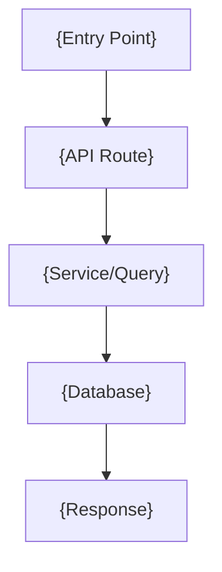

# PRD Template

Copy this template when creating a new PRD. Replace all `{placeholder}` values.

---

# PRD: {Feature Name}

**Project**: {Linear project name}
**Initiative**: {Initiative name}
**Date**: {YYYY-MM-DD}
**Status**: Draft | Approved

## Overview

{2-4 sentences. What is this feature, who uses it, what problem does it solve?}

## Business Motivation

{Why is this being built now? Business pain, success metrics, deadlines.}

## Scope

**In Scope**:
- {Feature A}
- {Feature B}

**Out of Scope**:
- {Feature X — explicitly not included}
- {Feature Y — future iteration}

## Architecture



{Brief explanation of the diagram.}

## Data Model

### Table: `{table_name}`

| Column | Type | Notes |
|--------|------|-------|
| `id` | `UUID` | PK, default `uuid_generate_v4()` |
| `organization_id` | `UUID` | FK → organizations, NOT NULL |
| `{field}` | `{type}` | {description} |
| `{amount}_cents` | `BIGINT` | Monetary value in cents |
| `created_at` | `TIMESTAMPTZ` | Default NOW() |
| `updated_at` | `TIMESTAMPTZ` | Default NOW() |

**RLS Policy**: `organization_id` matches `auth.jwt() user_metadata organization_id`

## API Specification

```
{METHOD} /api/v1/{resource}
Permission: {resource.action}
Query params: { {param}?: {type} }
Request body: { {field}: {type} }
Response: { data: {Type} }
```

## UI Specification

**Affected routes**: `{/path/to/page}`

{Description of UI changes, component hierarchy, key interactions.}

## Security Requirements

- **Permissions**: `{resource.list}`, `{resource.create}` (see `docs/permissions.md`)
- **Org scoping**: All queries must filter by `organization_id`
- **RLS**: Enable on `{table_name}`, policy scopes to org
- **PII**: {None | Encrypted fields: list them}
- **Audit log**: {None | Log events: list them with event names}

## Acceptance Criteria

1. {Testable criterion}
2. {Testable criterion}
3. Organization scoping: org A cannot access org B's {resource}
4. Validation: missing required fields returns HTTP 400 with descriptive error
5. Quality gates pass: `pnpm lint`, `pnpm typecheck`, `pnpm test`

## Implementation Notes

**Patterns to follow**:
- {File path:line} — {why this is the right pattern}

**Known issues to avoid** (from `docs/solutions/`):
- {Solution file path} — {one-line summary}

**Testing strategy**:
- {Unit test approach}
- {E2E test approach if needed}

**Deployment notes**:
- {Any data migration steps needed}
- {Feature flag requirements if any}

## Open Questions

- [ ] {Unresolved question from alignment checkpoint}
